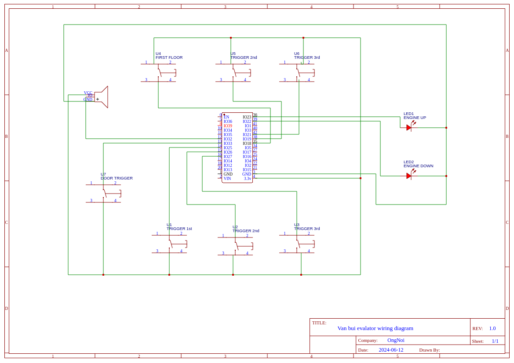

# Thiết kế Mạch Điều Khiển thăng máy tự chế cho nhà ông Bùi Đình Vân

## Sơ đồ Thiết kế

           ___
          | E |
          |___|
           |||
           |||
     ______|||
    |      ||| 
    |______|||
           |||
           |||
     ______|||
    |      |||
    |______|||
           |||
           |||
     ______|||
    |      |||
    |______|||

- Thang máy gồm 1 động cơ trên nóc tầng 3
- Thang máy bình thường sẽ nằm ở tầng 2 để không bị vướng lối đi lại ở tầng 1 .
- Thang máy được cân bằng bằng đối trọng nằng trong ray
- Thang máy được cố định vào ray, chỉ có thể di chuyển lên và xuống
- Hệ thống phanh khẩn cấp bằng gia tốc hoặc tốc độ ( cần viết chi tiết )
- Giai đoạn một sẽ dùng động cơ là tời kéo
- Hệ thống điều khiển bằng ESP32

## Sơ đồ mạch điều khiển ESP32


## Sơ đồ mạch demo



- Các nút được set up INPUT_PULLUP nên cần nối 1 đầu với GND
- Cac nut dc dieu khien qua thu vien ezButton
- Gồm 8 nút 3 nút gọi thang, 3 nút trigger khi thang tới từng tầng, 1 nút trigger cửa thang, 1 nút cho công tắc an toàn ở dưới đáy thang

    - Nút gọi thang 1,2,3 lần lượt là 18,19,21
    - Nút trigger thang 1,2,3 lần lượt là 25,26,27. Đây là các lẫy được đặt ở tầng 1,2,3 để báo cho thang máy biết
      thang đã đến tầng nào.
    - Nút trigger cửa thang là 33 khi nút này được bấm (giữ) (`digitalRead(DOOR_CLOSE_TRIGGER) == LOW`) thì là cừa đang
      đóng => thang máy được phép di chuyển. Nếu nút này được thả ra (`digitalRead(DOOR_CLOSE_TRIGGER) == HIGH`) thì cửa
      thang mở thanh máy ko được phép di chuyển
    - Nút công tắc an toàn ở dưới đáy thang là 32. Khi nút này được bấm thì thang máy sẽ dừng lại ngay lập tức và không
      được phép di chuyển cho đến khi nút này được thả ra
    - Buzzer / loa báo hiệu thang đã đến tầng nào: Pin 32. Đây là active buzzer module nên để nó phát ra tiếng cần set
      `digitalWrite(BUZZER_PIN, HIGH)` và để nó ngưng phát tiếng cần set `digitalWrite(BUZZER_PIN, LOW)`. Xem hàm `playTone()`
    - 1 motor để demo cho động cơ thang máy

- Nút trigger thang sẽ sử dụng limit switch

- Wring sẽ như này để code không thay đổi (code đang dùng push button)

| C pin | No Pin                           | NC pin        | ESP32 Input state                      |  
|-------|----------------------------------|---------------|----------------------------------------|
| GND   | ESP32 Input Pin (with pull-up)   | not connected | LOW when touched,  HIGH when untouched |  
- PIN của các nút/côngg tắc
```C++
#define ONEST_FLOOR 18  // Nút gọi thang tang 1
#define TWOND_FLOOR 19  // Nút gọi thang tang 2
#define THREE_FLOOR 21  // Nút gọi thang tang 3

#define TRIGGER_FIRST_FLOOR_DOWN 25 // Công tắc trigger thang tang 1
#define TRIGGER_SECOND_FLOOR_DOWN 26 // Công tắc trigger thang tang 2
#define TRIGGER_THIRD_FLOOR_DOWN 27 // Công tắc trigger thang tang 3

#define DOOR_CLOSE_TRIGGER 33  // Công tắc trigger cửa thang

#define BOTTOM_STOP_TRIGGER 32 // Công tắc an toàn ở dưới đáy thang
```
- Cài đặt cơ bản tốc độ cổng serial ( monitor)

```c++
Serial.begin(115200);
```

monitor_speed = 115200

- Cài đặt điều khiển bằng Bluetooth tên thiết bị là ONGNOI

```c++
SerialBT.begin("ONGNOI"); //Bluetooth device name

+ Đối với Web Bluetooth API , cần thêm thư viện Bluetooth Low Energy
BLEDevice::init("ONGNOI"); // Set the name of the device
 // Create a BLE Service
  pService = pServer->createService(BLEUUID("Your UUID")); // Service Generic Access

  // Create a BLE Characteristic and add it to Service
  pCharacteristic = pService->createCharacteristic(
      BLEUUID("Your UUID"), // Characteristic Device Name
      BLECharacteristic::PROPERTY_READ |
      BLECharacteristic::PROPERTY_WRITE
  );


  // Add Characteristics to Service
  pService->addCharacteristic(pCharacteristic);

  // Register Service with Server
  pService->start();

  // Start promoting the name
  pServer->getAdvertising()->start();

```

- Chân điều khiển động cơ kéo lên là chân 23 ( được setup OUTPUT)
- Chân điều khiển động cơ nhả xuống là chân 22 ( được setup OUTPUT)

```C++
#define ENGINE_UP_PIN 23
#define ENGINE_DOWN_PIN 22

//Setup pins mode for the engine
  pinMode(ENGINE_UP_PIN, OUTPUT);
  pinMode(ENGINE_DOWN_PIN, OUTPUT);

```

- Chân điều nhận tín hiệu từ cảm biến khi đến các tầng 1,2,3 lần lượt là 25,26,27 ( được setup INPUT_PULLDOWN)

```C++
#define TRIGGER_FIRST_FLOOR_DOWN 25
#define TRIGGER_SECOND_FLOOR_DOWN 26
#define TRIGGER_THIRD_FLOOR_DOWN 27
 // setup pins mode for trigger
  pinMode(TRIGGER_FIRST_FLOOR_DOWN, INPUT_PULLDOWN );
  pinMode(TRIGGER_SECOND_FLOOR_DOWN, INPUT_PULLDOWN );
  pinMode(TRIGGER_THIRD_FLOOR_DOWN, INPUT_PULLDOWN );
```

- Chân nhận tín hiệu điều khiển các nút ở bên trong thang máy khi đến các tầng 1, 2 ,3 lần lượt là 18,19,21(được setup
  INPUT_PULLDOWN)

````C++
  #define ONEST_FLOOR 18
  #define TWOND_FLOOR 19
  #define THREE_FLOOR 21
  //setup pins mode for button in elevator
  pinMode(ONEST_FLOOR, INPUT_PULLDOWN);
  pinMode(TWOND_FLOOR, INPUT_PULLDOWN);
  pinMode(THREE_FLOOR, INPUT_PULLDOWN);
``
- Tập lệnh điều khiển từ Bluetooth


```c++
#define WHERE_ARE_YOU 'w'
#define WHAT_STATUS 's'
#define FIRST_FLOOR_PRESS '1'
#define SECOND_FLOOR_PRESS '2'
#define THIRD_FLOOR_PRESS '3'
#define TRIGGER_STATUS 't'
```

- Lệnh w dùng để hỏi xem thang máy đang ở đâu ( kết quả trả về cho thiết bị hỏi là một trong các giá trị 1,2,3 tương ứng với 3 tầng như dưới)
```c++
#define FIRST_FLOOR 1
#define SECOND_FLOOR 2
#define THIRD_FLOOR 3

if(data == WHERE_ARE_YOU){
      Serial.write("WHERE_ARE_YOU CMD ");
      SerialBT.write(to_char(current_pos));
    }

```
- Lệnh s dùng để hỏi trạng thái của thang máy ( kết quả sẽ là đang lên, đang xuống , đang đứng yên)
```c++
#define UP 1
#define DOWN 2
#define STOP 0

if(data == WHAT_STATUS){
      Serial.write("WHAT_STATUS CMD ");
      SerialBT.write(to_char(current_status));
    }
```
- Lệnh t dùng để hỏi trạng thái của của các trigger  
```c++
 if (data == TRIGGER_STATUS) {
      SerialBT.write(digitalToString(digitalRead(TRIGGER_FIRST_FLOOR_DOWN)));
      SerialBT.write(digitalToString(digitalRead(TRIGGER_SECOND_FLOOR_DOWN)));
      SerialBT.write(digitalToString(digitalRead(TRIGGER_THIRD_FLOOR_DOWN)));
    }
```


## Quá trình vận hành
### Quá trình vận hành thang máy cần 3 giai đoạn 
1. Gọi thang máy đến tầng X ( thang máy có thể đang ở bất kỳ đâu)
2. Người lên => Vận chuyển đến tầng Y ( bước 1 và 2 có thể xảy ra nhiều lần)
3. Thang máy rảnh và tự trở về tầng 2 ngủ

### Tạm thời
1. Tạm thời chưa làm chức năng chọn tầng khi di chuyển , dùng tạm chức năng gọi thang để di chuyển
2. Tạm thời khi trigger được bặt nó sẽ dừng mà không cần biết tầng cần di chuyển là tầng nào do (1)
3. Tạm thời chưa có bộ đếm thời gian để tính khi nào sẽ chuyển thang máy sang trạng thái ngủ (Chuyển về tầng 2)
